# shelters-as-artworks

#### Overview

*This document presents an illustrated list of shelters-as-artworks, and artworks that deal with the concept of shelter. This list was compiled through the generous aid and goodwill of many helpful individuals, [in this Twitter thread](https://twitter.com/golan/status/1359883485016686603).* 

#### License

*This compilation is public domain, [licensed under CC0](https://creativecommons.org/share-your-work/public-domain/cc0/) ("No Rights Reserved"). The texts and images below have been liberally and hastily copy-pasted from online sources, typically without attribution; please be careful re-using them.*

#### How to Contribute

*This list is a procrastination project that I assembled to give a student a leg up with their research. The easier you make it for me to add something to the list, the more likely I will add it. If you wish to submit a project to this compilation, [please file an issue here](https://github.com/golanlevin/shelters-as-artworks/issues) and provide the following information:* 

* *Name of the artists or creators*
* *Title of the artwork or project*
* *Year that it was made or started*
* *One single URL that has the most representative or best documentation of the project*
* *A brief description of what the project IS, including some information on why it's interesting (approximately 20-50 words long, please)*
* *PNG or JPG Image, ~1000 pixels wide.*

---

## Projects

Michael Rakowitz, *paraSITE* (1997). 'Stealing' the vented air from buildings, these structures attach to the air outtake ducts of buildings, which serve as the “host” from which they derive the warm air that heats and inflates them.
([link](https://www.moma.org/learn/moma_learning/michael-rakowitz-parasite-homeless-shelter-1997/))
([link](https://architizer.com/blog/inspiration/stories/michael-rakowitz-parasite/))

---

Krzysztof Wodiczko, *Homeless Vehicle Project* (1988). A pushcart mobile shelter for the homeless. ([link](https://walkerart.org/magazine/krzysztof-wodiczkos-homeless-vehicle-project))

---

N55 (Danish art collective), *SNAIL SHELL SYSTEM* (2001). The SNAIL SHELL SYSTEM is a low cost system that enables persons to move around, change their whereabouts and live in various environments. One unit supplies space for one person. It is mobile both on land and water. One person can move it slowly, either by pushing it like a wheel, walking inside it or on top of it On water it can be rowed, moved by a kite or hooked up to a vessel, for example, a ferry. ([link](https://www.n55.dk/MANUALS/SNAIL_SHELL_SYSTEM/sss.html)).

---

Raumlaborberlin (Axel Timm, Benjamin Foerster-Baldenius), *Shabby Shabby Apartments* (2015). "An experiment in Munich, which shows a different view of the city with one of the top-ten-rents in Europe: What would happen, if everyone leaves their homes and build booths [apartments] at the most unlikely places in the city?" ([link](https://raumlabor.net/shabbyshabby-apartments/)

---

Andrea Zittel, *A-Z Wagon Station* (2003). An alternative temporary structures for living, produced under the guise of her fictive one-person corporation, “A–Z Administrative Services.” ([link](https://www.guggenheim.org/artwork/20713))

---

Gregory Kloehn, *Homeless Homes Project* (2014).  Kloehn builds miniature houses for people living on the streets in Oakland, California, "constructing the shelters from trash that has been illegally dumped, collecting everything from cargo pallets and window frames to pizza delivery bags and washing machine doors." ([link](https://mymodernmet.com/gregory-kloehn-homeless-homes-project/))

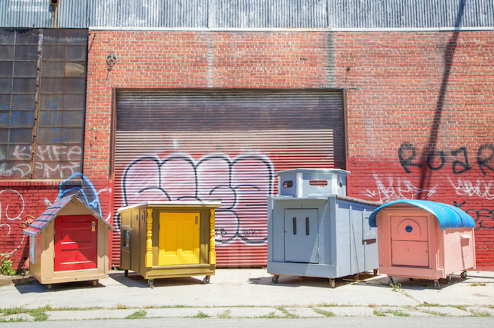

---

The Yes Men, *Survivaball* (2009). On September 22, 2009 the Yes Men demonstrated on the alleged behalf of Halliburton and dozens of other climate threatening corporations an inflatable ball-shaped costume known as the SurvivaBall, claiming it was a self-contained living system for surviving disasters caused by global warming. Over two dozen people wore the SurvivaBall costumes as it was demonstrated in the East River.
([link](https://en.wikipedia.org/wiki/The_Yes_Men#New_York_Post_and_SurvivaBall))

---

Lucy + Jorge Orta, *Refuge Wear* (1992-1998). Temporary shelters and architectures that can be transformed into clothing to offer protection from harsh conditions and shelter in emergency situations. ([link](https://www.studio-orta.com/en/artworks/serie/1/Refuge-Wear)

---

Jae Rhim Lee, *N=1=NPK=KIMCHI=N* (2006). Customized diet, kimchi, and mobile living unit with hydroponic garden, urinal, urine processor, bed, and kitchen. ([link](https://www.studiojaerhimlee.com/portfolio/n1npkkimchin/))

---

Jonas Staal, *Interplanetary Species Society* (2019). Interplanetary Species Society (ISS) consists of a large-scale installation in the form of an alternative biosphere in the Reaktorhallen, the former underground nuclear facility of Stockholm. The biosphere contains assemblies of humans, ammonites, meteorites and proletarian plantae, exploring new forms of comradeship between human, non-human, and more-than-human agents. ([link](http://jonasstaal.nl/projects/interplanetary-species-society/))

---

Fernando Abellanas, *Hidden Studio* (2017). A parasitic structure: "a covert studio beneath a graffiti-covered bridge in the Spanish city of Valencia, making use of the concrete infrastructure to form a roof and walls for the hideaway." ([link](https://www.dezeen.com/2017/08/18/secret-studio-under-bridge-fernando-abellanas-architecture-valencia-spain/))

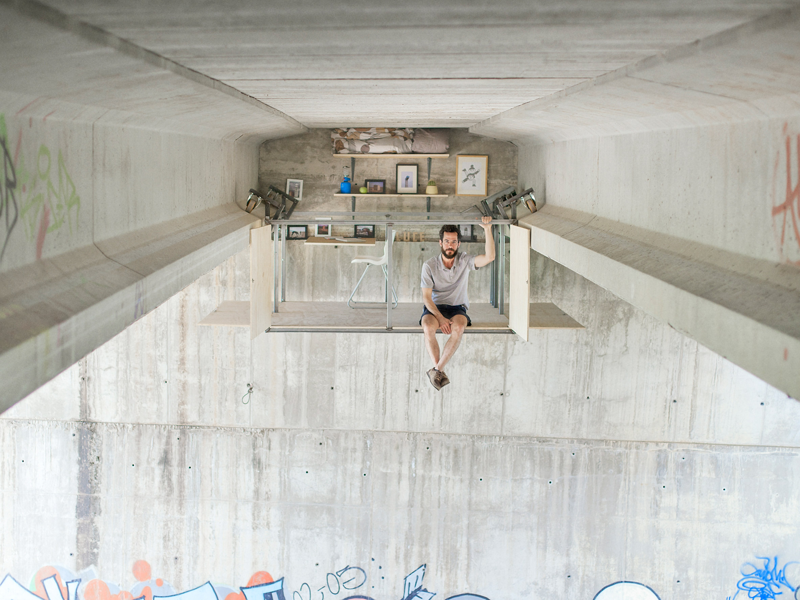

---

Ilya & Emilia Kabakov, *In the Closet* (1997). The installation is arranged in the foyer of some establishment in a neutral space or in a walkway or wide corridor in a museum – precisely in a place where there is no ‘artistic’ object whatsoever or where a work of art is totally unexpected. The viewer, walking through such a place, sees an old closet built into the wall, one door of which is slightly ajar. The built-in closet should attract attention precisely because of its old, worn appearance as compared to the ‘modern’ white space of the wall. When the viewer opens the closet, to his great surprise he sees a table on which the ‘inhabitant’ eats, a corner for dishes, and a light-bulb for reading burns above a narrow bed. Everything in this residence is very crowded, intended for a long and comfortable life. The whole idea of the installation becomes immediately obvious to the outside viewer: the person who has settled into the closet has hidden precisely from such curious people as the viewer. ([link](http://www.kabakov.net/installations/2019/9/14/in-the-closet))

---

Jonah Freeman, Justin Lowe and Alexandre Singh, *Hello Meth Lab in the Sun* (2008). Multi-room recreation of a meth lab. "The installation effectively recreates a cinematic environment in real time, allowing viewers to transform into actors, or detectives, investigating the remains of a narrative and piecing the roles and characters back together." ([link](https://voodhu.wordpress.com/tag/hello-meth-lab-in-the-sun/))

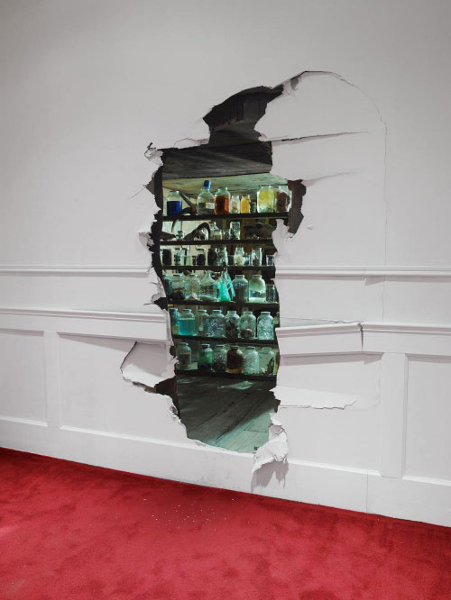

--- 

Superflux, *Mitigation of Shock* (2017). "We built an entire future apartment situated in the context of climate change and its consequences on food security. The installation transports visitors into a London flat, around 2050 or so." ([link](https://superflux.in/index.php/work/mitigation-of-shock/#))

---

WLDN, *The Vigil*, 2020. "For 365 days, twice a day, a Vigil keeps watch over the city in the Shelter on a high, culminate point in the city. Each Vigil participates only once. The Vigil is free to choose their own date and time and registers for participation on the Vigil website dedicated to the project. The performance is open to everyone of adult age. In the morning the Vigil starts from sunrise, in the evening it is from an hour before sunset. The Vigil performer is silent and stands alone in the Shelter, holding a presence over the city. ([link](http://www.wldn.fr/index.php/eng/the-vigil-project/))

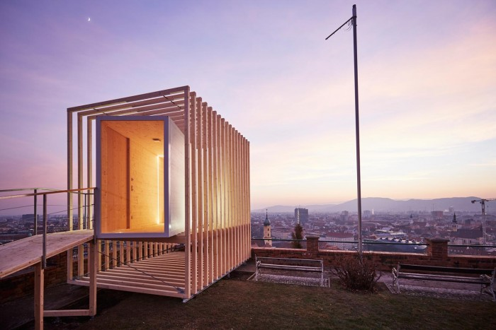

---

Taro Hattori, *Rolling Counterpoint* (2016). Mobile teahouse for dialogue and conversation. ([link](http://www.tarohattori.com/projects/rolling_counterpoint.php))

---

Ken Isaacs, *Beach Matrix* (1967). "a populist form of architecture that, because of its low cost and ease of construction, allowed a broad range of publics to participate in the design process". ([link](http://www.johannesreponen.com/journal/2016/10/16/beach-matrix-1967-installation-by-american-architect-and-designer-ken-isaacs))

Ken Isaacs, *Living Structures* (1974). A book a building sustainable, eco-friendly, modular, flexible, multi-functional living structures which reconfigure the entire volume of a room, being bigger than furniture and smaller than architecture. ([link](https://issuu.com/golfstromen/docs/ken-isaacs-1974))

---

Mary Mattingly, *FlockHouse* (2012). Inspired by global human migration, immigration and pilgrimage, Flock House is built upon reclaimed, redesigned, and rethought materials acquired through local barter networks. ([link](https://marymattingly.com/pdfs/FHBookTest2.pdf))

---

Keg de Souza, *Redfern School of Displacement and Program* (2016). An artist-run school held inside a temporary structure made from salvaged tents, acknowledging the Traditional Owners and Custodians of the land on which its exhibition takes place. ([link](http://www.kegdesouza.com/portfolio/redfernschoolofdisplacement/))

---

Tracey Emin, *Everyone I Have Ever Slept With 1963–1995* (1995). A tent with the appliquéd names of, literally, everyone she had ever slept with (not necessarily had sex with). ([link](https://en.wikipedia.org/wiki/Everyone_I_Have_Ever_Slept_With_1963%E2%80%931995)). 

---

Chris Burden, *Beehive Bunker* (2006). A sculpture that simulates a war bunker, resembling a lookout post, constructed of 332 sacks of ready-mix concrete stacked in alternating rows. ([link](https://artsandculture.google.com/asset/beehive-bunker/dgFVnYTPGKjEEg?hl=en))

---

Aram Bartholl, *Keepalive* (2015). The boulder contains a thermoelectric generator which converts heat directly into electricity. Visitors are invited to make a fire next to the boulder to power up the wifi router in the stone which then reveals a large collection of PDF survival guides. ([link](https://arambartholl.com/keepalive/))

---

Dawn Scarfe, *Bivvy Broadcasts* (2013). The artist is in a forest somewhere in England, streaming live ambient sound through the night while trying to sleep in a bivvy (bivouac sack shelter). Her guerilla-style broadcasts are set up after dark using a small microphone and tenuous 4G connection. By listening you can help keep vigil over her situation. ([link](http://www.dawnscarfe.co.uk/project_broadcast))

---

Tehching Hsieh, *Outdoor Piece* (1981). "In 1981, Taiwanese endurance artist Tehching Hsieh ventured out into the streets of New York City and proceeded to live outdoors for a full year. Hsieh essentially takes on the identity of a homeless individual—although “houseless” would be a more apt description of his type of purposeful displacement—calling into question tensions between public and private spaces and their impact on our everyday lives, as well as the way in which public spaces are navigated on a daily basis." ([link](https://dca.ue.ucsc.edu/dca/winners/2016/796))

---

DAAR (Sandi Hilal and Alessandro Petti), *The Concrete Tent* (2018). "This installation takes the form of the temporary refugee tent, but is solidified in concrete: it embodies the paradox of permanent temporariness." ([link](http://www.decolonizing.ps/site/2018/02/permanent-temporariness-in-abu-dhabi-2/)

---

Sam Jacob, *Dar Abu Said* (2016). A replica of a refugee shelter, captured by 3D scanning a real shelter in the Calais Jungle (a sprawling migrant camp), and constructed from CNC-milled synthetic stone. ([link](https://www.dezeen.com/2016/06/03/v-a-victoria-albert-world-of-fragile-parts-replica-refugee-shelter-sam-jacob-3d-copying-exhibition-venice-architecture-biennale-2016/))

---

Rachel Whiteread, *Ghost* (1990). Whiteread cast in plaster the interior of a Victorian living room at 486 Archway Road in North London. In Whiteread’s words, Ghost causes the "viewer to become the wall." ([link](https://www.nga.gov/collection/art-object-page.131285.html))

---

Marie Watt, *Engine* (2009). A replica of a cave made with felted wool. ([link](http://www.mariewattstudio.com/work/project/engine))

---

Samuelle Green, *The Paper Caves Project* (2017). A large scale sculptural installation. ([link](https://www.youtube.com/watch?v=hqb99cbakAc))

---

Heather Hart, *The Oracle of Lacuna* (2017). "Hart constructed a rooftop-structure on Storm King’s campus, which visitors could climb atop of or enter through a dormer window. In collaboration with Storm King, the artist planned extensive public programming to take place on the installation and within it, such as musical performances, a poetry slam, shrine-making and story-telling workshops." ([link](https://www.heather-hart.com/oracle-of-lacuna))

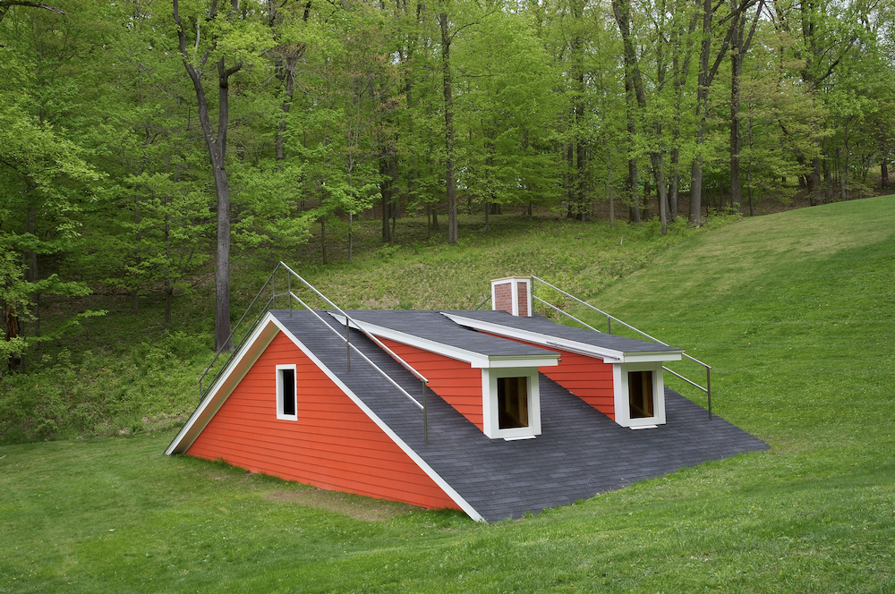

---

Gordon Matta-Clark, *Splitting* (1974). Matta-Clark made a vertical slice into an old frame house located in Englewood, New Jersey. The film documenting this action "is composed of intentionally artless footage showing Matta-Clark and his friends making two parallel cuts down the center of the house; jacking up one half of the structure and beveling the cinderblock supporting it; and then lowering that half back down, bisecting the home and creating an ephemeral display of light inside the once-compartmentalized interior." ([link](https://www.artic.edu/artworks/187171/splitting))

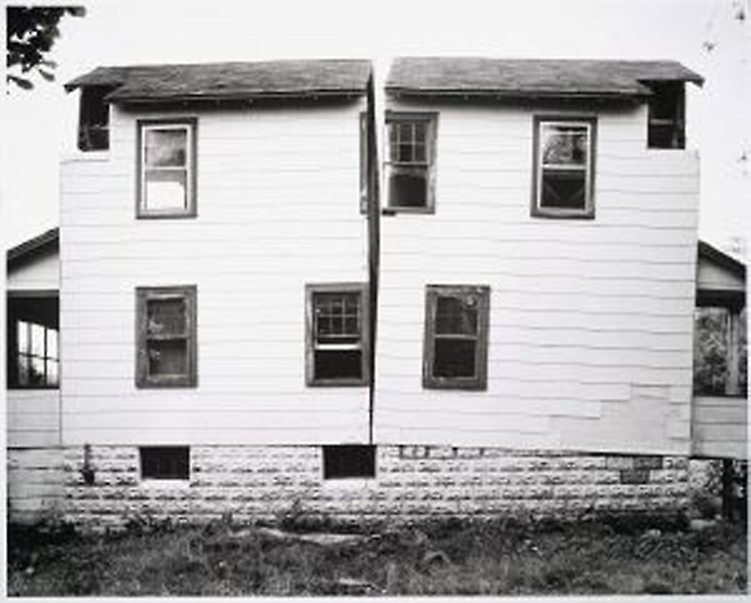

---

Cornelia Parker, *Cold Dark Matter: An Exploded View* (1991). A garden shed and its various miscellaneous contents, which have been blown up by the army. The exploded shed is suspended from the ceiling of the gallery with a single light source at its centre, as if in mid-explosion. ([link](https://chisenhale.org.uk/exhibition/cornelia-parker/))

---

Thomas Hirschhorn, *Never Give Up the Spot* (2018). "An experiment to combine destruction and creation. To this end, Thomas Hirschhorn transforms the Museum Villa Stuck into a ruin." ([link](https://e-flux.com/announcements/209187/thomas-hirschhornnever-give-up-the-spot/))

---

Thomas Hirschhorn, *Gramsci Monument* (2013). Hirschhorn enlisted 42 residents, paid $12 an hour, to help him to build the monument. The structure, sprawling the approximate footprint of a single family home, is raised several feet high on a wooden platform centered in a 200-foot-wide green space between a cluster of Forest Houses towers. It is composed of two distinct areas accessible by four ramps and two staircases on each side. ([link](https://urbanomnibus.net/2013/07/thomas-hirschhorns-precious-and-precarious-bronx/))

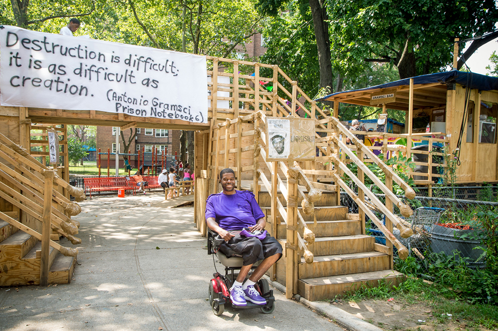

---

Elena Kolesnkova, *Voskhod Cooperative* (2020). "A series investigating and recreating Russian garage cooperatives' strategies for converting non-residential spaces into impermanent homes with infrastructure that can be relocated." ([Link](http://typography-online.ru/2020/06/20/elena-kolesnkova-voskhod-eng/))

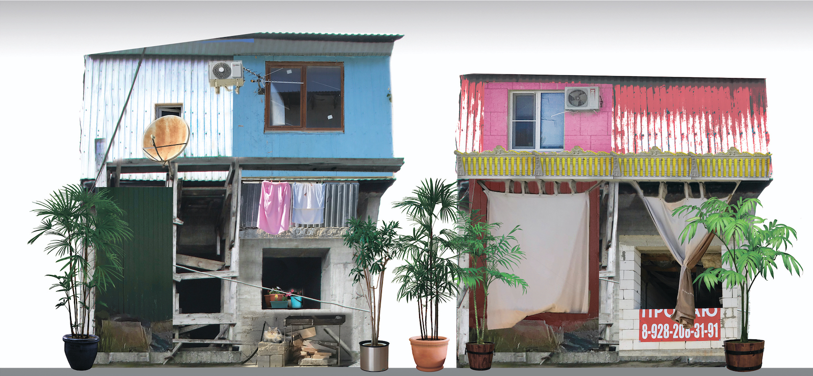

---

Mario Merz, *Igloos* (1967-). In 1967 Mario Merz began working on his first Igloo, a hemispherical domed structure that represents a temporary and nomadic architectural ideal, a house simultaneously ancient and contemporary, a symbol of the celestial vault and of conviviality. ([link](https://www.wallpaper.com/art/mario-merz-igloos-exhibition-pirelli-hangerbicocca))

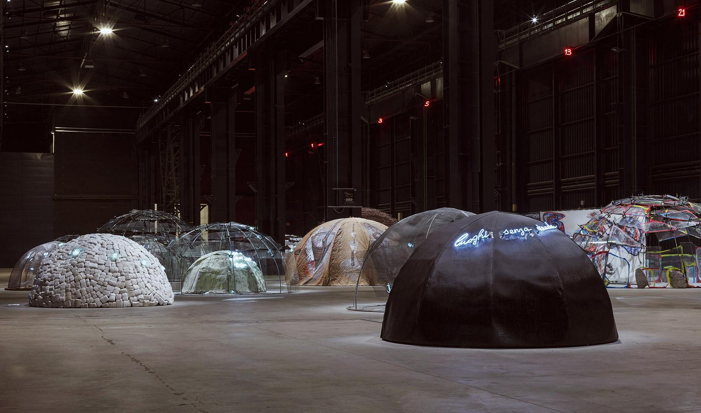

---

Agnes Meyer-Brandis, *Research Raft for Subterranean Reefology* (2005). 
A tent-shelter containing a probe that can be lowered into the earth’s deeper layers and bring to light the unknown. ([link](https://archive.transmediale.de/content/sgm-eisberg-sonde-sgm-iceberg-probe))

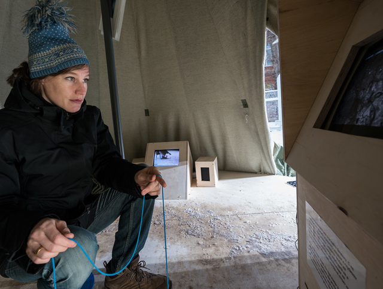

---

Kevin Cyr, *Tiny Bike Trailer Mobile Homes*. "Artist and designer Kevin Cyr seems obsessed with portable housing and mobile living. In his own unique creations, he manages to pack impressive amenities (bed, lighting, storage and much more) into the smallest of interior spaces." 
([link](https://dornob.com/small-mobile-homes-bike-trailers-shopping-cart-campers/))

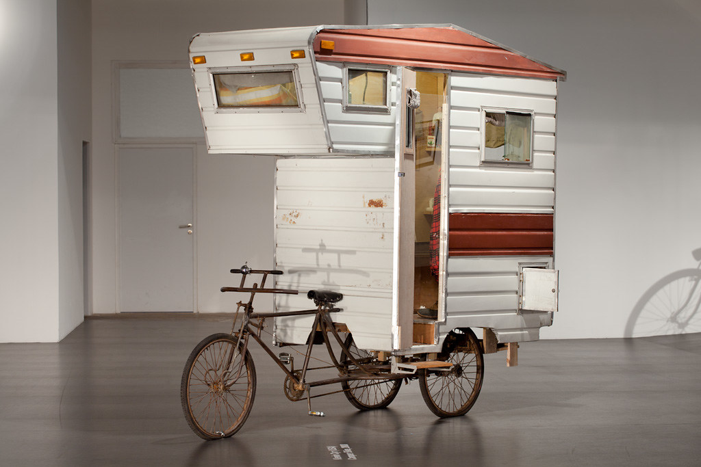

---

Dominic Wilcox, *Stained Glass Driverless Sleeper Car*. "As a vision for the future of transportation, Dominic Wilcox has realized a driverless car that unites intricate, handmade glass work with cutting-edge technologies. the vehicle is imagined as vessel for nighttime travel, accommodating only a bed inside; while the passenger rests, the car autonomously drives them to their destination." ([link](https://www.designboom.com/design/stained-glass-driverless-sleeper-car-by-dominic-wilcox-09-19-2014/))

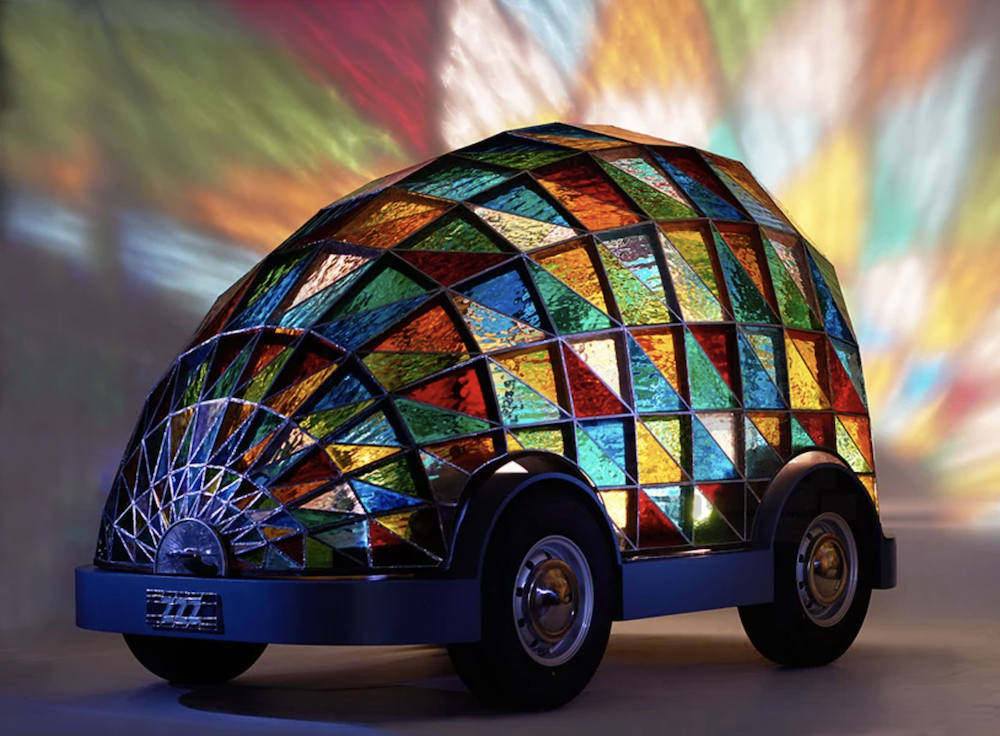

---

Edward Kienholz, *Back Seat Dodge ‘38* (1964). Controversial sculpture depicting an amorous encounter in the back seat of a truncated car. ([link](https://www.artsy.net/artwork/edward-kienholz-back-seat-dodge-38))

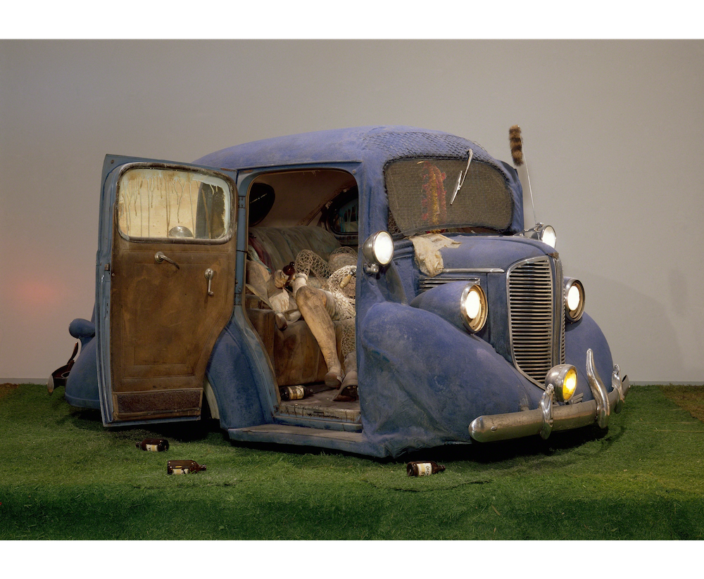

---

Amos Lattier, *Pigeon Condo* (2006). "Pigeon Condo is developing luxury housing for pigeons at the desirable intersection of Yonge Street and the Lakeshore Boulevard, in the heart of Toronto's revitalized waterfront." ([link](http://latteier.com/))

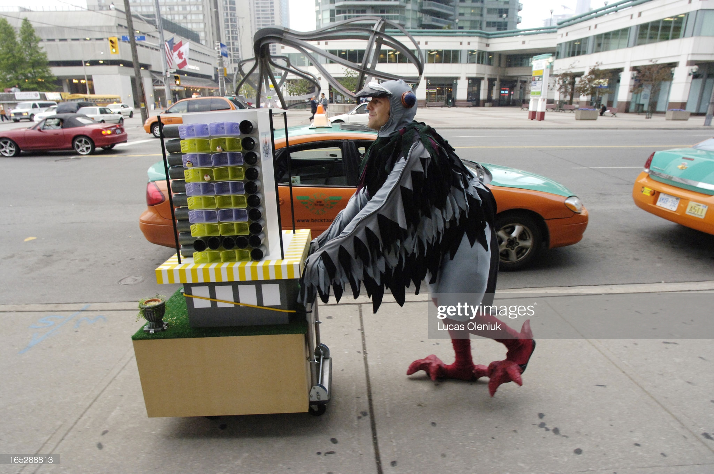

---

Judy Chicago and Miriam Schapiro, *Womanhouse* (1972). "A feminist art installation and performance space, an environment where women’s conventional social roles could be shown, exaggerated, and subverted. Only women were allowed to view the exhibition on its first day."
([link](https://mcachicago.org/Publications/Websites/West-By-Midwest/Research/Topics/Womanhouse))

---

*Habitat for Artists* (2008-2016). "HFA is a collective project that uses the idea of the artist’s studio as a catalyst for mutual engagement between artists and communities. The “habitats” are small, temporary, 6’ by 6’ studios installed at a variety of locations: some highly visible to the local community; others, more unexpected venues for experiencing art or connecting with the process of artists engaging in creative work."
http://habitatforartists.org/

---

*Art Shanty Projects* is an annual event featuring artist-built shelters on a frozen lake in Minnesota. Their website has an archive. ([link](https://artshantyprojects.org/))

---

Since 2009, *Warming Huts: An Art + Architecture Competition on Ice* has been melding world-class design and art with Winnipeg’s famous winters. Warming Huts is an open competition, for designs that best “push the envelope of design, craft and art.” Competition winners travel to Winnipeg to construct and install their warming huts amidst a large ice-skating area. ([link](https://www.warminghuts.com/))

---

David Darts, *Nomads* (~2019). A class in which students design shelters-as-artworks. "What can the unique human ecology and worldview that emerges from mobile ways of life teach us about human ingenuity and culture? This course uses the lenses of philosophy, art, and design to examine the history, influence, and cultural underpinnings of nomadism and nomadic dwelling." ([link](https://daviddarts.com/nomads))

---

Shigeru Ban, *Paper Partition System* (2018). Disaster relief shelter in Okayama, a modular system of partitions using recycled paper tubes, cardboard panels and fabric to create areas that can be curtained off for privacy. ([link](https://www.dezeen.com/2018/07/31/shigeru-ban-temporary-shelters-paper-japan-flooding-architecture/))

---

Vito Acconci, *Convertible Clam Shelter* (1990). Fiberglass, clam shells, steel, rope, lights, and sound equipment
Dimensions variable. (Acconci has also made many other shack-like structures.) ([link](https://mcachicago.org/Collection/Items/1990/Vito-Acconci-Convertible-Clam-Shelter-1990))

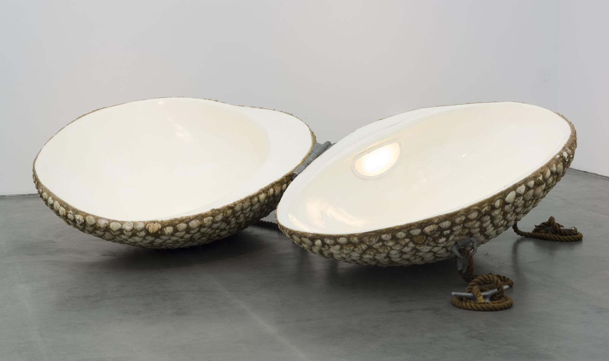

---

Louise Bourgeois, *Femme Maison* (1946). "A series of paintings by French-American artist Louise Bourgeois addressing the question of female identity. In these paintings, the heads and bodies of nude female figures have been replaced by architectural forms such as buildings and houses. *Femme Maison* translates from the French as ‘housewife’: literally, ‘woman house’." ([link](https://en.wikipedia.org/wiki/Femme_Maison))

---

Laurie Simmons, *Walking House* (1989). "In *Walking House*, the sleek legs of a young starlet or model support a toy suburban house of the sort the young woman might have grown up in and in which—after marriage—she is destined to live." ([link](https://www.moma.org/collection/works/48215))

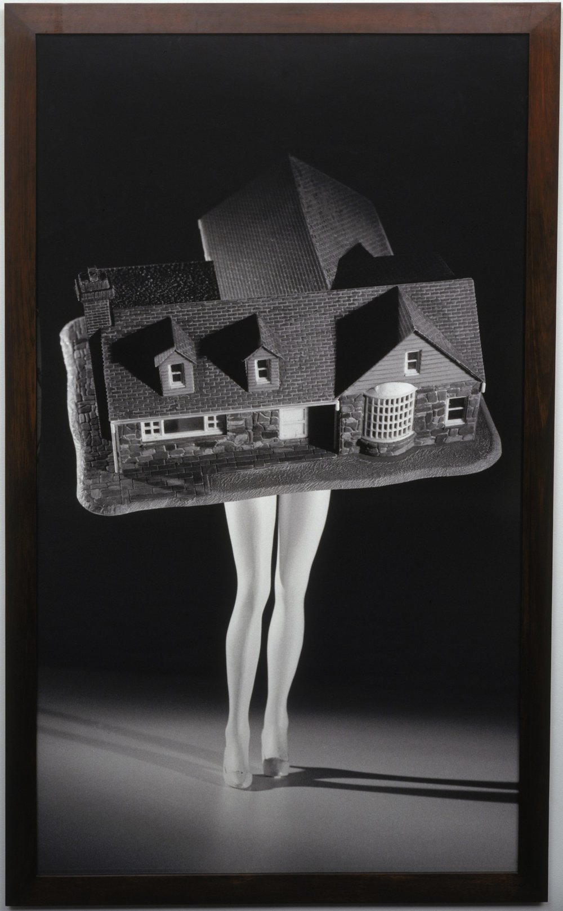

## As-Yet-Unprocessed References

*This is a landfill of references I haven't tidied yet. Any assistance is welcome; please see [how to contribute](https://github.com/golanlevin/shelters-as-artworks#how-to-contribute).* 

* I AM THE DESIGNER OF THIS RESTAURANT’S OUTDOOR SEATING SPACE, AND THIS IS MY ARTIST’S STATEMENT https://www.mcsweeneys.net/articles/i-am-the-designer-of-this-restaurants-outdoor-seating-space-and-this-is-my-artists-statement
* Simone Leigh’s work (representations of homes and shelters)
* Martin Marro, *Proyecto Bunker*
* Sack and Reicher + Muller & Eyal Zur's "Sway" / 'Fugitive Structures'  - it's a collab with architects & artist
* “MY EMF COMFORT ZONE” 2009 Todd Slaughter’s 3d head scan tent (in American Primitives)
* Santiago Cirugeda's works
* Do Ho Suh's works; 
* Nil Yalter’s Nomad tents
* Laure Tixier’s plaid houses;
* Not An Alternative (Collective) http://magazine.art21.org/2011/05/19/5-questions-for-contemporary-practice-with-not-an-alternative/#.YCWEABNKiyE
* Roman Signer, Signer's Suitcase https://www.youtube.com/watch?v=HA58UzPVfDg&feature=youtu.be
* Will Rynan’s America, Martin Puryear, and Rina Banerjee’s pink Taj Mahal; 
* Jill Sigman; 
* “Anthony McCall, sort of.";  
* Dennis Oppenheim; 
* Martha Poggioli - Tent Dress (2018) - http://analogritual.com/Tent-Dress; 
* christoph schlingensief; 
* Basic House
https://martinazua.com/product/basic-house/; 
* Thomas Schütte has a series of bunkers, but also did Houses https://www.kunstmuseumluzern.ch/en/exhibitions/thomas-schuette-houses/; 
* Ron Tran https://www.bethanien.de/en/artists/ron-tran/; 
* Rirkrit Tiravanija, Untitled (jacket turns to tent), 2007 - https://www.artsy.net/artwork/rirkrit-tiravanija-untitled-jacket-turns-to-tent; 
* Verbeke Foundation has a colon shelter/guesthouse you can rent out for a night https://twitter.com/joonturbo/status/1359977468459970562/photo/1; 
* Theaster Gates, Stony Island Arts Bank - https://theastergates.com/project-items/stony-island-arts-bank; 
* For the love of God by Curro Claret
https://curroclaret.com/en/dificiles_por_el_amor_de_dios_santa_anna.html; Roden Crater, by James Turrell; James Turrell, Deer Shelter Skyspace @YSPsculpture https://ysp.org.uk/openair/jamesturrell/deershelterskyspace; 
* Antal Lakner, The Icelandic Army, https://manifesta13.org/wp-content/uploads/2019/05/Lakner.jpg; Geraldine Juarez' and Adam Bobbette's Forays from 2007: https://we-make-money-not-art.com/i_read_about_yo/; https://www.rebeccabelmore.com/biinjiyaiing-onji-from-inside/;
* the covert apartment built by two artists in a shopping mall parking lot: http://wrafwraf.com/trummerkind.html; 
* Apocalypse Anonymous by 
@LorenRubicana and Tiyan Baker https://rubicana.info/portfolio/apocalypse-anonymous/; 
* Rachel whiteread nissen hut https://twitter.com/printiprinter/status/1360138352645857282; 
* Lisa Karrer - https://burchfieldpenney.org/exhibitions/exhibition:12-11-2020-03-28-2021-lisa-karrer-shelter/; 
* Swoon in Haiti: https://mymodernmet.com/swoon-bamboo-house-konbit-shelter/; 
* https://www.phillips.com/detail/rirkrit-tiravanija/NY010309/121 Roller: Cinéma De Ville; 
* Sheela gowda, dark room 2006, https://twitter.com/Dhruva_Storz/status/1362013566539358209;
* Disastr Hotel by DV Rogers http://disastr.urbanaction.org
* Taro Hattori http://tarohattori.com/projects/rolling_counterpoint.php
* http://anthonystephenson.org/art/artHistory/drmstnd.htm
* http://postmastersart.com/archive/guy06/guy06.html
* https://toddcsmith.com/Bernheim-Nest
* Ana Rewakowicz's wearable inflatable shelters .. http://rewana.com/prototypes-sleeping-dress.html
* Robert Ransick has completed a 6 month Residency at Eyebeam developing Casa Segura (Safe House). https://we-make-money-not-art.com/i_am_actually_f/
* Satoshi Murakami, My Small Mobile House and other https://siaf.jp/siaf2020/en/news/artist/satoshi-murakami/s
* Adam Stenneett’s survival shelters - http://adamstennett.com/arcticsurvivalshack.html
* Tentative architecture by @xarene https://vimeo.com/1043224 
 
 
 
